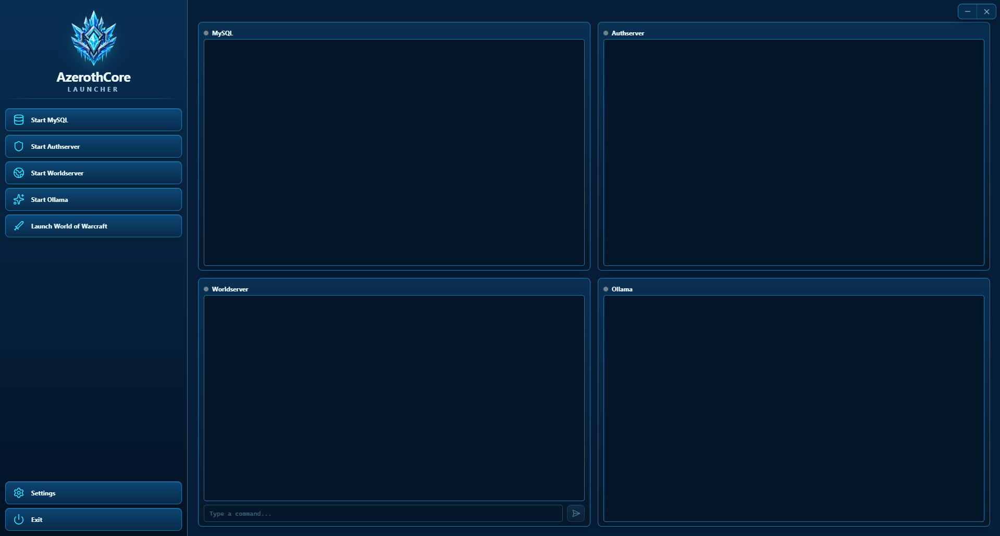

# AzerothCore Launcher

A Windows desktop launcher for local [AzerothCore](https://www.azerothcore.org/) servers, built with Tauri 2, Rust, React, and TypeScript. It starts and stops MySQL, Authserver, Worldserver, and Ollama from one maximized dashboard and displays each process in a real ConPTY-backed terminal.



## Features

- Four integrated ANSI terminals with bounded scrollback and live resize
- Start and stop controls for MySQL, Authserver, Worldserver, and Ollama
- Interactive Worldserver command input with account-command suggestions
- Settings for database credentials and executable paths
- Windows DPAPI protection for the stored SQL password
- Detached World of Warcraft client launch
- Single-instance activation and deterministic process cleanup

## Requirements

### Using a release

- Windows 10 or Windows 11 (64-bit)
- Microsoft Edge WebView2 Runtime (normally already installed on current Windows systems)
- AzerothCore server binaries configured in Settings
- Ollama on `PATH` if the Ollama panel is used

The release executable is ready to run. End users do not need Node.js, npm, Rust, or Visual Studio Build Tools.

### Building from source

Run:

```bat
build.bat
```

The script validates the required tools, installs locked frontend dependencies, runs a Tauri release build without an installer bundle, and copies the result to:

```text
dist\AzerothCore Launcher.exe
```

Source builds additionally require Node.js 22.12 or newer with npm, Rust 1.85 or newer with the MSVC toolchain, and Visual Studio Build Tools with **Desktop development with C++**.

## Development

```bat
npm install
npm run tauri dev
```

Useful checks:

```bat
npm run lint
npm run typecheck
npm test
cd src-tauri
cargo fmt --check
cargo clippy --all-targets --all-features -- -D warnings
cargo test
```

## Configuration

Settings are stored at `%APPDATA%\AzerothCore Launcher\config.json`. Relative executable paths resolve from the launcher executable directory in release builds and the current working directory during development.

Default executable paths are:

- `.\mysql\bin\mysqld.exe`
- `.\authserver.exe`
- `.\worldserver.exe`

See [docs/configuration.md](docs/configuration.md) for the complete schema and troubleshooting guidance.

## Service shutdown behavior

| Service | Graceful stop method |
| --- | --- |
| Worldserver | `server shutdown 1` through ConPTY |
| Authserver | Ctrl+C through ConPTY |
| MySQL | Adjacent `mysqladmin.exe shutdown` using the configured SQL connection |
| Ollama | Ctrl+C through ConPTY |

## Disclaimer

This is a community tool for self-hosted AzerothCore servers. It is not affiliated with Blizzard Entertainment or the AzerothCore project. World of Warcraft is a trademark of Blizzard Entertainment.

## License

GNU General Public License version 3. See [LICENSE](LICENSE).
