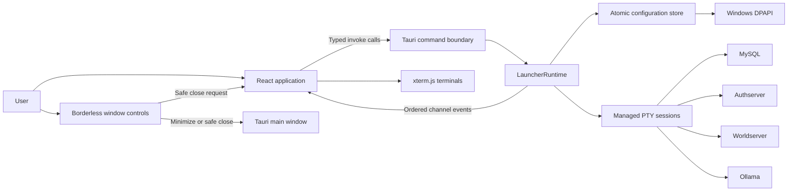

# Architecture

## Process boundary

The application deliberately keeps privileged operations in Rust. The webview can open native file-selection dialogs and invoke a fixed set of typed Tauri commands, but it receives no generic shell or filesystem capability.

`LauncherRuntime` coordinates service state and the frontend event channel. Focused runtime modules own managed ConPTY sessions and the short-lived MySQL shutdown helper. The process waiter observes the Windows process handle independently from PTY output, then closes ConPTY and joins the reader before publishing the idle state. Its completed handle remains owned until restart or application shutdown, so no worker is detached.

### Component overview

The command boundary is deliberately narrow: React can request launcher operations, but it has no generic shell or filesystem access.

## Data flow

1. React registers one ordered Tauri channel with `initialize`.
2. A start request validates the configured executable, creates ConPTY, and spawns the child from its correct working directory.
3. A dedicated reader forwards natural 8 KiB output chunks to xterm.js without interpreting ANSI sequences in Rust.
4. An independent waiter observes process termination, closes the retained PTY handles, joins the reader, and publishes the idle state.
5. Terminal resize observations measure a borderless inner host, then update both xterm.js and the associated ConPTY dimensions. The surrounding frame owns visual padding and borders so those decorations cannot be mistaken for usable terminal columns.

The frontend writes output directly to xterm.js instead of keeping scrollback in React state. This prevents terminal traffic from causing whole-application rerenders. xterm protocol replies are returned through the typed terminal-input command; this is restricted to bundled frontend content by the application CSP.

## Display and scaling model

The borderless native window starts maximized and is not resizable. Compact overlay controls provide only minimize and safe close actions without reserving a full title-bar row. The terminal grid reserves only the small upper-right control footprint.

The 360-pixel sidebar remains fixed while the terminal area uses fractional CSS grid tracks, so extra space on 2K and 4K displays expands the terminals instead of stretching the sidebar. Windows display scaling is handled by WebView2 in logical pixels, and each terminal is refitted through `ResizeObserver` whenever its panel changes size.

The terminal grid and surrounding workspace use a fixed Icy Blue palette. Terminal viewports use a deep blue-black canvas that remains distinct without falling back to pure black; xterm preserves stable ANSI service-log colors, scrollback, and PTY ownership.

All interactive controls share a forged-glass presentation layer rendered by WebView2. Layered icy gradients, an inset highlight, and a common motion curve provide consistent hover and press feedback, while semantic variants distinguish primary, secondary, destructive, icon-only, window, and service actions. Sidebar controls use a compact 44-pixel row with 7-pixel spacing; active and transitioning controls use palette-specific cyan or blue edges and surfaces, while the terminal header dot retains amber as the transition-state signal. Reduced-motion preferences replace animated feedback with static state styling. These effects remain frontend-only and do not add native permissions or change command routing.

Application modals use the native HTML `dialog` top layer while retaining launcher-owned styling. WebView2 therefore keeps focus inside the active modal, routes Escape only to the top dialog, and restores focus to the originating control when the dialog closes. Dialogs own their WebView scrollbar styling, including the track, thumb, hover color, width, and suppression of native Windows arrow buttons. Settings uses a single sectioned form with divider-based hierarchy rather than nested bordered panels. xterm uses a separate four-pixel measured gutter so its FitAddon and ConPTY always agree on the usable column count.

The square ice crest is a frontend asset displayed above the existing launcher title. The Windows application icon is stored as a single ICO with standard 16, 32, 48, 64, 128, and 256-pixel frames. Tauri 2.11 decodes only the first ICO entry for its default runtime window icon, which would leave the taskbar enlarging the 16-pixel frame. During setup, the launcher instead loads the compiled `IDI_APPLICATION` resource at DPI-aware small and large system dimensions and assigns both native icon roles. It repeats that assignment after a monitor scale-factor change so mixed-DPI moves remain sharp. The handles use Windows' shared-resource ownership and require no launcher cleanup. The Cargo build script watches the ICO explicitly so raw no-bundle builds always regenerate and relink the Windows resource library after an icon change.

### Fixed Icy Blue palette

The Icy Blue palette is defined once through root semantic CSS tokens and an explicit xterm canvas theme. It is not stored in settings or returned through initialization, so the appearance cannot drift between the frontend, terminal canvas, and persisted configuration.

## Public command interface

| Command | Purpose |
| --- | --- |
| `initialize(onEvent)` | Registers the ordered backend channel and returns the current service snapshot. |
| `load_settings()` | Returns decrypted settings for editing inside the local webview. |
| `save_settings(settings)` | Normalizes editable settings, encrypts the password, and atomically persists configuration. |
| `validate_executable_path(value)` | Resolves a configured path and returns whether it is a file. |
| `start_service(serviceId, columns, rows)` | Starts a configured service in ConPTY. |
| `stop_service(serviceId)` | Applies the service-specific graceful stop operation. |
| `write_service(serviceId, text)` | Writes a command; restricted to Worldserver. |
| `write_terminal_input(serviceId, data)` | Returns bounded xterm-generated control responses required by ConPTY. |
| `resize_service(serviceId, columns, rows)` | Resizes an active ConPTY. |
| `launch_world_of_warcraft()` | Launches the configured client detached from the launcher. |
| `running_services()` | Returns non-idle services in safe shutdown order. |
| `exit_application(force)` | Refuses unsafe exit or terminates all owned sessions before exiting. |

Backend events are tagged as `output`, `stateChanged`, or `error`. Service identifiers are `mysql`, `authserver`, `worldserver`, and `ollama`; states are `idle`, `starting`, `running`, and `stopping`. `stateChanged(idle)` is the authoritative process-exit notification.

## Security and secrets

SQL passwords are encrypted with Windows DPAPI in the current-user scope and sent to `mysqladmin` only through `MYSQL_PWD`. The password is never appended to a command line. The shutdown helper is created with `CREATE_NO_WINDOW`, so its console-subsystem executable remains invisible while its stdout and stderr are still drained into bounded diagnostics. Display-breaking control characters are removed from those diagnostics while readable line breaks and tabs are preserved. Configuration is written through a same-directory temporary file and atomically persisted.

## Application lifecycle

The single-instance plugin is registered before other plugins. A secondary launch maximizes and focuses the existing main window. Both the overlay close control and native close requests use the same React exit workflow; running services are listed before the user can force exit. Rust also performs cleanup from the application exit event so OS-level close paths cannot bypass owned-process cleanup.

The MySQL shutdown helper is tracked separately from the MySQL server PTY because `mysqladmin` is a short-lived child of the launcher. On exit, the launcher first checks for active services; a confirmed forced exit takes exclusive ownership of the session map, terminates and joins the helper, closes each service's PTY resources, joins readers and waiters, publishes idle states, and exits.

Settings defaults, trimming, and port normalization are authoritative in Rust at the typed IPC boundary. The frontend displays field guidance and sends the editable values without maintaining a second normalization implementation. The persisted `settings_completed` flag remains internal and only contributes the snapshot's `needsFirstRunSetup` value.

Startup discovery and Tauri construction return structured errors rather than panicking. If startup fails before a webview exists, the Windows GUI-subsystem entry point shows one native error dialog with the underlying cause and then exits cleanly.
